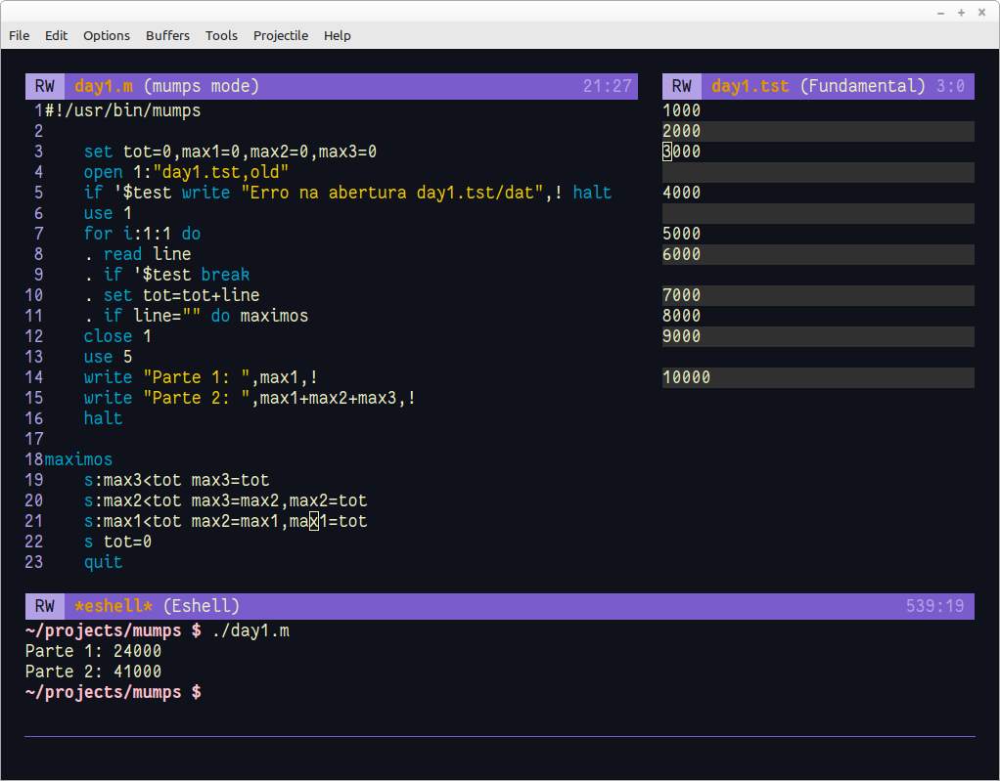

Problema: https://adventofcode.com/2022/day/1


Basicamente temos um conjunto da valores numéricos separados por uma linha em branco. 

1. A linha 3 inicializa as variáveis do programa

2. As linhas 4-6 abrem e utilizam o arquivo para a leitura dos dados.

3. A linha 7 é um loop infinito (```1:1:10``` iniciaria em 1, com incremento de 1 até chegar em 10)

4. A linha 8 lê uma linha do arquivo

5. A linha 9 testa se chegou ao final do arquivo, saindo do loop em caso positivo

6. A linha 10 soma o valor da linha em **tot**. Note que não foi necessário nenhuma conversão. 

7. As linhas 11-13 primeiro verifica se é uma linha em branco. Se for, indicando final da amostra de dados, atualizamos **max** caso seja menor que **tot**.

8. A linha 14 atualiza **max** para o último registro

9. As linhas 15-16 fecham o arquivo da dados aberto e indicam para utilizar o terminal

10. A linha 17 mostra o resultado na tela (a exclamação indica nova linha)

Interessante também é a indentação que utiliza pontos para cada nível. Facilita a leitura até com qualquer editor de textos.

Para quem não conhece a linguagem, acho que ficou bom com apenas 17 linhas. 

### parte dois

Bem, os problemas do AoC, após resolvida a parte um, abre a possibilidade de resolver a parte dois. Necessita de alguma alteração no programa desenvolvido para a parte 1.

O programa apto para resolver as duas partes do problema ficou assim:



- Como a primeira parte queria saber o maior e a segunda parte os três maiores valores, criei a rotina *maximos* que já calcula os três maiores valores. A primeira parte é o maior e a segunda a soma dos três maiores. 

- Note um ```halt``` no final do programa para que ele não execute a rotina novamente. Para o término da rotina é utilizado o ```quit```. 

- A expressão ```s:max3<tot max3=tot``` seria o equivalente a ```if max3<tot then max3=tot```.

- As variáveis são globais mas, na função maximo, poderia ter ```new tot``` que seria considerada local.
