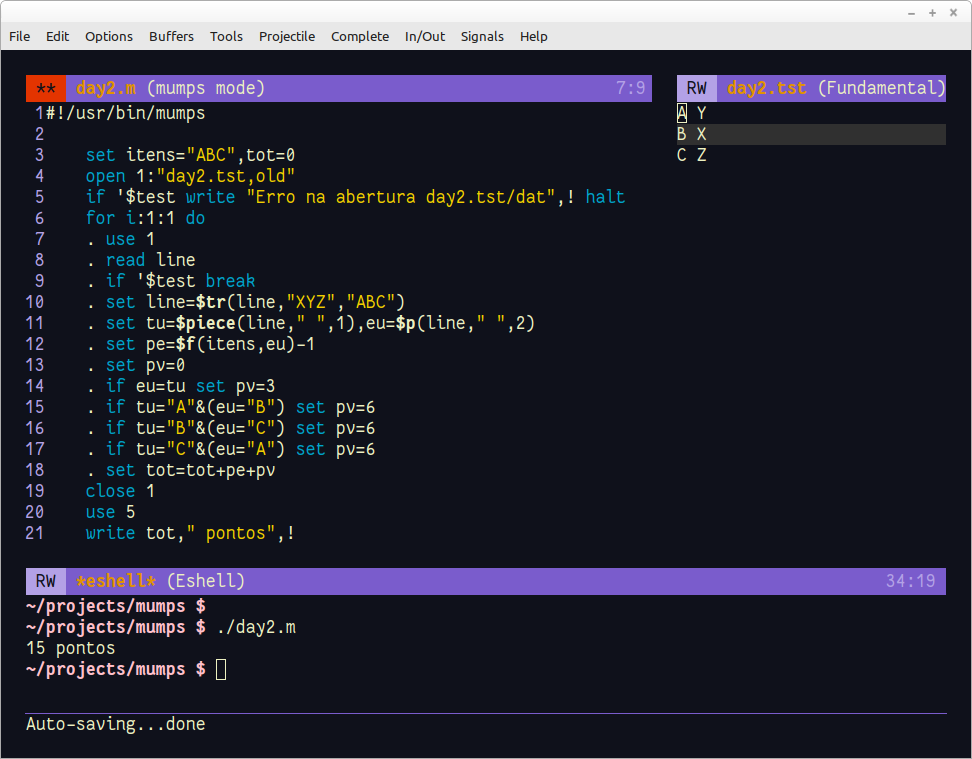

Problema: https://adventofcode.com/2022/day/2



1. Teria que ler mais a documentação para ver o que é possível fazer com os  ```ifs``` das linhas 14-17. 

2. Não vi lógica em utilizar os códigos *A*, *B* e *C* para o adversário e *X*, *Y* e *Z* para o jogador sendo que se referem a pedra, papel e tesoura. A linha 10 normaliza (quem usa Linux conhece o tr). **Na realidade tem, para a parte dois que não foi feita.**
