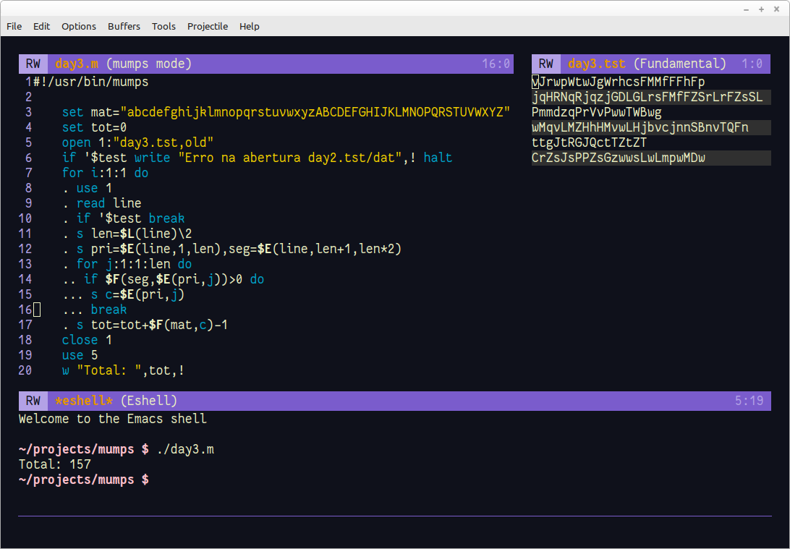

# Dia 3

Problema: https://adventofcode.com/2022/day/3

- Basicamente é para ler o arquivo de dados, quebrar a linha em duas partes iguais e verificar qual a letra existe nas duas partes (diferenciando maiúsculas e minúsculas). Atribui o valor de 1 a 16 para as letras minúsculas e 27 a 52 para as maiúsculas. 

- **$L**ength para o tamanho da linha

- **$E**xtract para quebrar a linha em duas partes

- **$F**ind para ver se o caractere da parte um existe na parte dois e para atribuir o valor usando a variável **mat**. Note que nos três comandos usei só o necessário que era a primeira letra (alguns pode ser necessário duas letras).
