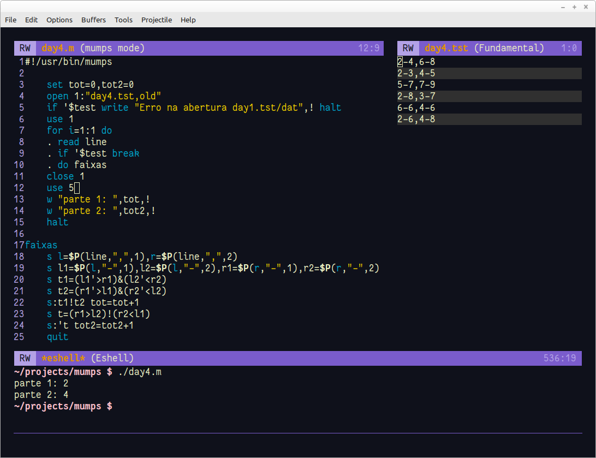

# Dia 4

Problema: https://adventofcode.com/2022/day/4



- Basicamente vere se existe uma intersecção total ou parcial (parte 1 ou 2)

- A linha 18 separa as duas partes divididas por vírgula

- A linha 19 separa os números

- Nas linhas 23 e 24 somamos se houve a intersecção total ou parcial que foi verificada e o resultado está nas variáveis de teste (t1 t2 e t). **s:t tot=tot+1** soma se for verdadeira e **s:'t tot=tot+1** soma se for falso já que testei se não houve intersecção (se o primeiro for maior que o último ou o último for menos que o primeiro)

**Obs.**

Confesso que me atrapalhei um pouco nas comparações. Estou tão viciado em usar ```>=``` ou ```<=``` que, a inexistência desses operadores (pelo menos na versão do M que estou utilizando) me fazia parar para pensar um pouquinho. Se for ```>=``` siignifica que é não menor. Então devo utilizar ```'<```. Mas é bom para mexer com os neurônios. :D
