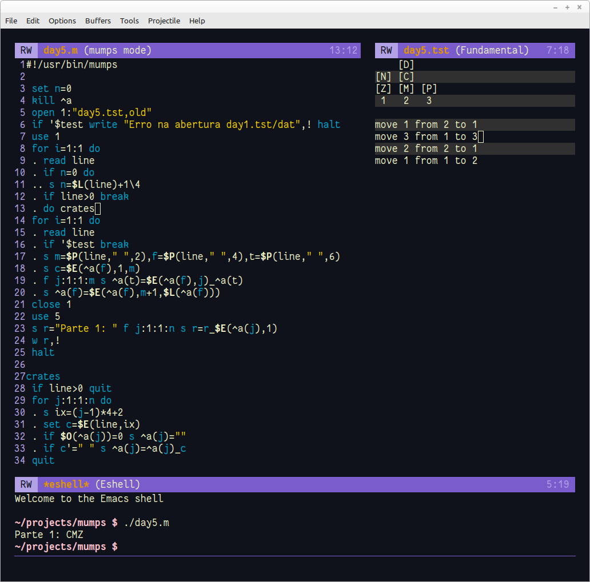

# Dia 5

Problema: https://adventofcode.com/2022/day/5



Poderia dizer que foi mais uma resolução tranquila mas não. Não sei se o problema é do interpretador, da linguagem ou meu. Usando variáveis locais, na linha 19 ele insistia em dizer que a variável não foi encontrada. Se eu colocasse um valor numérico funcionava. Testei com variáveis globais (que são armazenadas em disco e funcionou, sem outras alterações). Depois vejo se testo em uma outra implementação. Como as variáveis são gravadass, foi necessário usar o ```kill a``` para deletá-las a cada execução.

- A linha 18 pega os valores de move, from e to.

- As linha de 19 a 21 move os caixotes de uma pilha para outra.

- A rotina ```crates``` monta as pilhas de caixas.

Mesmo querendo escrever o programa de forma mais legível (todo o comando) para quem não conhece a linguagem, a abreviação é instintiva. A linha 23 me pareceu e, ainda parece, tão normal. Pessoalmente acho que o espaço deve ser o separador natural dos comandos (desde que não seja uma string é claro). 
